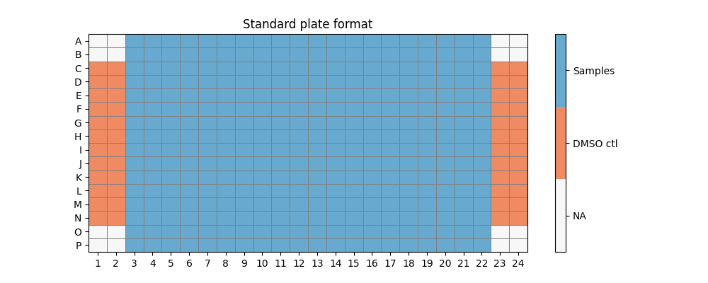

# HibitPlateFormat
Format for the hibit luciferase to generate graphical output along with data formating for further processing.
Basic plate map has the format below:

## usage:
### instruction
*  install [Anaconda](https://www.anaconda.com/)
*  Start Anaconda command prompt
*  In the command prompt type: `python` then `space`
*  Drag and drop the file `scatterTest.py`
*  add `space` before drag and drop the **Folder** containing the files of interest
		* **IMPORTANT:** the software relies on using files with file name `ffluc` and `nanoluc` typo in the file name will fail execution
*  press `Enter`
### test
This can be tested on the folder [NP DOSING](https://github.com/wAOndering/HibitPlateFormat/tree/main/NP%20DOSING)

## outputs:
Example of the outputs can be found [here](https://github.com/wAOndering/HibitPlateFormat/tree/main/NP%20DOSING/output)

### data files:
* `combinedOutput.csv`: contains normalized and raw values from nanoluc and ffluc plates in a long format with wellPosition
* `normPlate_norm_ffluc.csv`: is a matrix of the plate normalized to DMSO control for ffluc in a plate format (useful for heatmap
* `normPlate_norm_nanoluc.csv`: is a matrix of the plate normalized to DMSO control for nanoluc in a plate format (useful for heatmap)
* `outerSample.csv`: is a list of all the samples that fall outside of the threshold (3SD DMSO control)
* `Samples_stats.csv`: stats with CV, mean, SD, counts pers sample for raw and norm value of ffluc and nanoluc

### graph files:
*all graphs are output in *.png and *.pdf format*   
*In the graph the red line corrpesond to the 3SD from DMSO figSummary are in the same scale*
*White box in the heatmap will correspond to removed DMSO outliers*
* `figSummary`: can either be with scatter or kde plots and includes:
		* 2 heatmaps of the plate for ffluc and nanoluc in plate format
		* 1 scatter/kde of the entire plate colored by sample 
		* 1 scatter/kde plot of DMSO control only
* `figSummaryInd`: is an overlay of scatter and kde plot split by sample type (1 plot per sample)
* `figSummaryOuterSample`: correspond to samples falling outside of 3SD of DMSO control with labeled well position

### Examples
<!-- images here are created within a table -->
<table>
	<tr>
		<td>figSummary (kde)</td>
		<td>figSummary (scatter)</td>
		<td>figSummaryInd</td>
		<td>figSummaryOuterSample</td>
	</tr>
	<tr>
		<td></td>
		<td></td>
		<td></td>
		<td></td>
	</tr>
</table>

## Notes 
### color
Color options are defaulted to in the qualitative color maps ([link](https://matplotlib.org/3.5.0/tutorials/colors/colormaps.html#qualitative)) for more color options visit:

* [Python colors](https://matplotlib.org/3.5.0/tutorials/colors/colormaps.html)
* [Brewer link](https://colorbrewer2.org/)

Future implementation will have a custom color map based on user input that will be substituted to the default one
